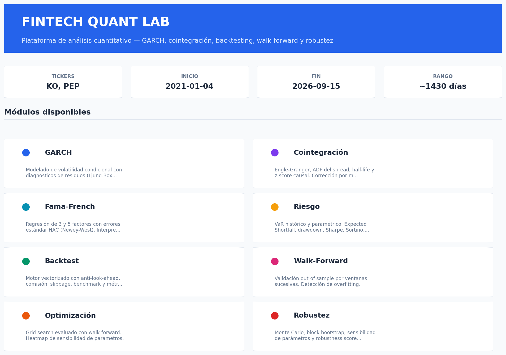
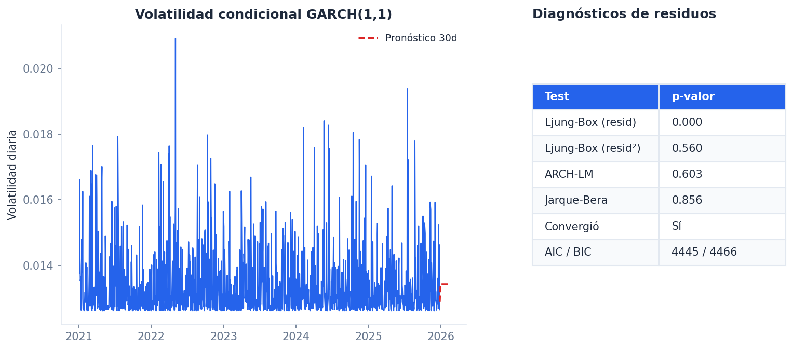
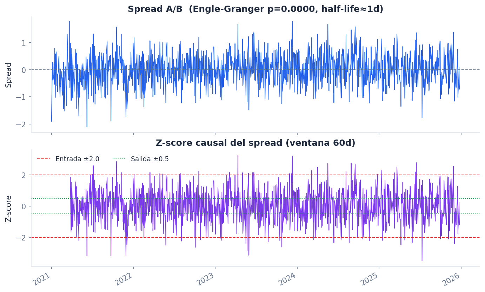
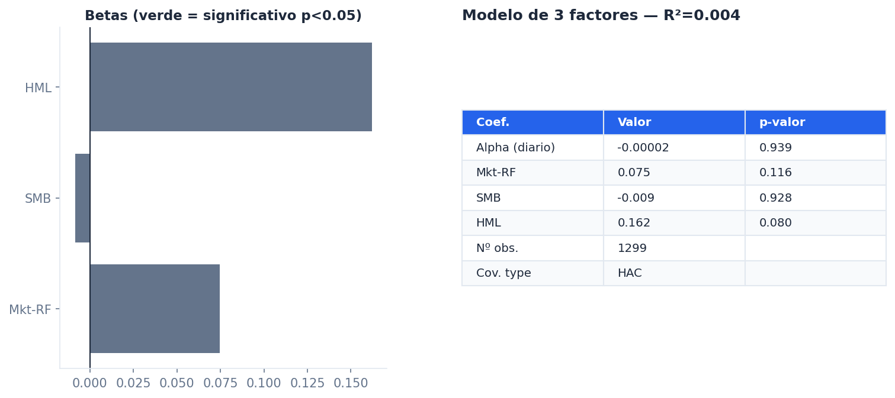
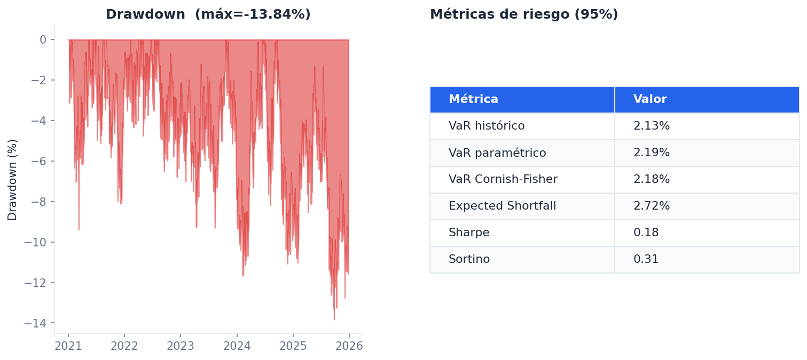
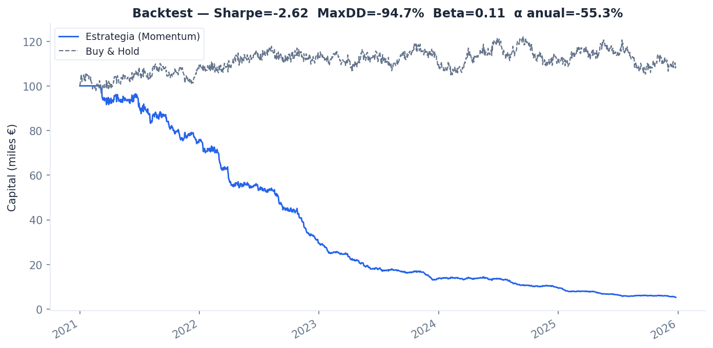
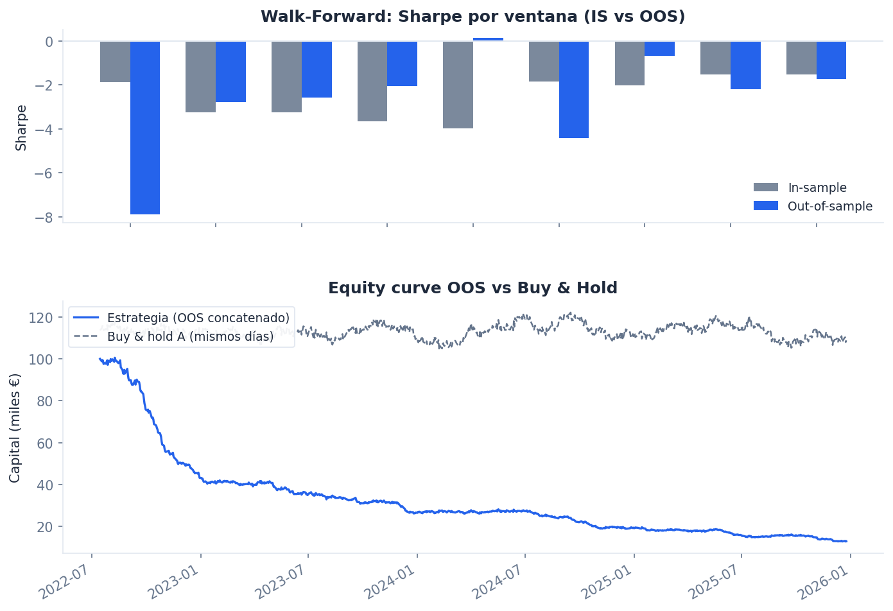
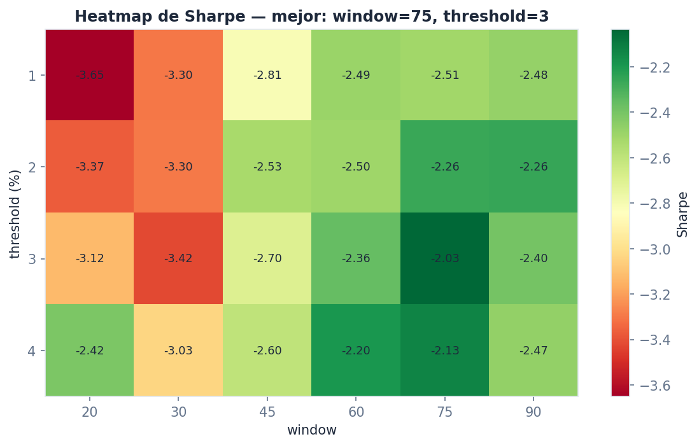
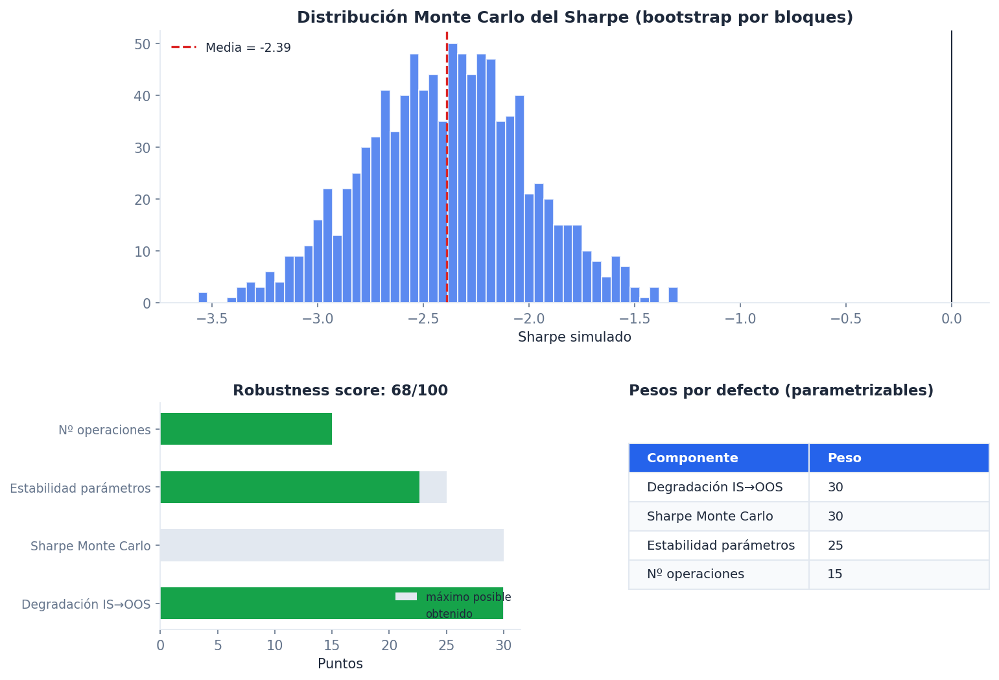
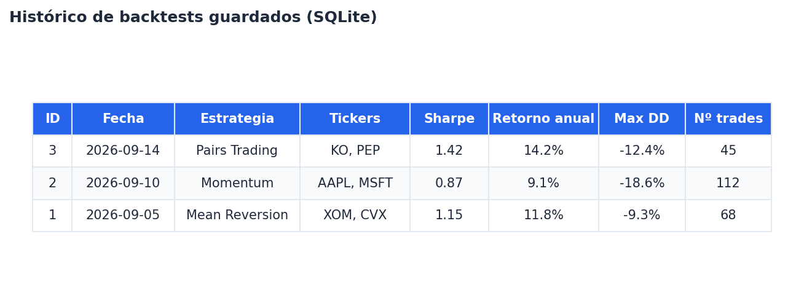

# 📈 Fintech Quant Lab

[](https://github.com/Juani1972/fintech-quant-lab/actions/workflows/ci.yml)
[](https://codecov.io/gh/Juani1972/fintech-quant-lab)
[](https://www.python.org/)
[](https://streamlit.io/)
[](LICENSE)
[](https://github.com/astral-sh/ruff)
[](CONTRIBUTING.md)

**Plataforma de análisis cuantitativo** para series temporales financieras:
volatilidad, cointegración, factores, riesgo, backtesting, walk-forward,
optimización, robustez y un histórico persistente de resultados.

> **Nota**: Este proyecto es educativo y de investigación. No constituye
> asesoramiento financiero. Ver [Disclaimer](#-disclaimer).

---

## 🚀 Demo

> **Demo pública**: *(en preparación — `fintech-quant-lab.streamlit.app`)*

Mientras se despliega, puedes ejecutarlo localmente con Docker en un comando:

```bash
docker-compose up --build
```

Accede en **http://localhost:8501**.

---

## 📸 Capturas

> Las imágenes de esta sección están generadas con `matplotlib` a partir de
> **cálculos reales** de `app.core` sobre un par de tickers sintético
> (no hay conexión a internet en el entorno donde se generaron) — no son
> capturas de pantalla de la app Streamlit en sí. Reflejan fielmente qué
> calcula y muestra cada página, pero no su maquetación exacta. Puedes
> regenerarlas con `python docs/screenshots/generate_mockups.py`, o
> sustituirlas por capturas reales de tu propia instancia (ver
> `docs/screenshots/README.md`).

### Portada


### GARCH — volatilidad condicional y diagnósticos de residuos


### Cointegración — spread, half-life y z-score causal


### Fama-French — regresión de factores con errores HAC
*(factores sintéticos en esta maqueta — `load_factors` real descarga de
Kenneth French, sin red en este entorno)*


### Riesgo — VaR, Expected Shortfall y drawdown


### Backtest — equity curve, Sharpe y métricas de benchmark


### Walk-Forward — Sharpe IS vs OOS y equity concatenada


### Optimización — heatmap de sensibilidad del grid search


### Robustez — Monte Carlo, robustness score y pesos


### Histórico — backtests guardados en SQLite


---

## ✨ Características

### Análisis estadístico
- **📈 GARCH / EGARCH / GJR-GARCH**: volatilidad condicional con
  diagnósticos de residuos (Ljung-Box, ARCH-LM, Jarque-Bera), control de
  convergencia del optimizador y pronóstico en las unidades originales
  de los retornos.
- **🔗 Cointegración**: Engle-Granger, ADF del spread, half-life, z-score
  causal. Estimación de α/β solo con el tramo de entrenamiento
  (`fit_until`) para evitar ajuste in-sample. **Corrección por múltiples
  tests** (Bonferroni, Benjamini-Hochberg).
- **📊 Fama-French**: regresión de 3 y 5 factores con **errores estándar
  HAC (Newey-West)** y interpretación de alpha.

### Riesgo
- **⚠️ Riesgo**: VaR histórico, paramétrico, **Cornish-Fisher** (ajustado
  por asimetría y curtosis) y de **simulación histórica filtrada** (FHS,
  usa la volatilidad condicional de un modelo GARCH ya ajustado);
  Expected Shortfall, drawdown, Sharpe, Sortino, Calmar.

### Backtesting y validación
- **🧪 Backtesting**: motor vectorizado O(n) con anti-look-ahead,
  comisión, slippage, dos modos de P&L (`percent` para precios,
  `absolute` para spreads que cruzan cero — p. ej. pairs trading) y
  métricas frente a benchmark (beta, alpha de Jensen, tracking error,
  information ratio).
- **🔬 Walk-forward**: validación IS/OOS por ventanas sucesivas, con
  parámetro de **embargo** opcional entre train y test.
- **🎯 Optimización**: grid search evaluado con walk-forward y
  **Deflated Sharpe Ratio** (Bailey & López de Prado) para corregir el
  sesgo de selección múltiple del "mejor" resultado del grid.
- **🛡️ Robustez**: Monte Carlo (GBM y block bootstrap), sensibilidad de
  parámetros, robustness score 0-100 con **pesos parametrizables** y
  análisis de cuánto depende el score del esquema de pesos elegido.
- **📚 Histórico**: cada backtest se puede guardar en SQLite local
  (tickers, parámetros, métricas) y consultarlo después como un informe
  de investigación formateado, exportable a Markdown.

### Interfaz
- **Streamlit multipágina** (9 páginas) con gráficos interactivos (Plotly).
- **Selector de universos de tickers** predefinidos (pares clásicos,
  Magnificent 7, sectores SPDR...) además de entrada manual.
- **Exportación CSV** en cada página, y de informes individuales en
  Markdown desde el histórico.
- **Caché de datos** desacoplada de Streamlit (`app/core/cache.py`), con
  política de NaNs configurable.

---

## 🧪 Tests y cobertura

```bash
pytest tests/ -v
pytest tests/ --cov=app --cov-report=html   # reporte HTML en htmlcov/
```

La suite tiene **171 tests** (incluye mocks de `yfinance`, regresión de
páginas duplicadas, smoke tests con `AppTest` de Streamlit, y tests
numéricos con valores teóricos conocidos para VaR, half-life, Deflated
Sharpe y Cornish-Fisher). Cobertura actual: **~77%**, mínimo exigido por
CI: **60%**. El CI ejecuta ruff, mypy y pytest en Python 3.10, 3.11 y 3.12.

---

## 🗂️ Estructura

```
fintech-quant-lab/
├── app/
│   ├── main.py                 # Punto de entrada (portada)
│   ├── config.py                # Configuración global, tema, registro de páginas
│   ├── state.py                 # Parámetros globales de sesión (tickers, fechas)
│   ├── styles.py                 # Componentes de UI reutilizables (hero, cards...)
│   ├── core/                    # Lógica de negocio (independiente de Streamlit)
│   │   ├── cache.py             # Caché desacoplada (único punto de acoplo a st)
│   │   ├── data_loader.py       # Descarga y calidad de datos (yfinance)
│   │   ├── universe.py          # Universos predefinidos de tickers
│   │   ├── garch.py             # GARCH / EGARCH / GJR-GARCH
│   │   ├── cointegration.py     # Engle-Granger, half-life, señales
│   │   ├── fama_french.py       # Factores con errores HAC
│   │   ├── multiple_testing.py  # Bonferroni, Benjamini-Hochberg
│   │   ├── risk.py              # VaR (histórico/paramétrico/CF/FHS), ES, ratios
│   │   ├── backtest.py          # Motor de backtesting + benchmark_metrics
│   │   ├── walkforward.py       # Walk-forward analysis + embargo
│   │   ├── optimization.py      # Grid search + WF + Deflated Sharpe Ratio
│   │   ├── robustness.py        # Monte Carlo, bootstrap, robustness score
│   │   ├── history.py           # Persistencia SQLite de backtests
│   │   └── plotting.py          # Gráficos reutilizables
│   └── pages/                   # 9 páginas Streamlit
├── notebooks/                   # 4 notebooks de ejemplo (jupytext)
├── tests/                       # Tests unitarios (171)
├── docs/screenshots/            # Capturas / maquetas para el README
├── .github/workflows/           # CI/CD
├── Dockerfile
└── docker-compose.yml
```

---

## 🛠️ Instalación

### Opción 1: pip (local)

```bash
git clone https://github.com/Juani1972/fintech-quant-lab.git
cd fintech-quant-lab
python -m venv venv
source venv/bin/activate        # Windows: venv\Scripts\activate
pip install -r requirements.txt
streamlit run app/main.py
```

### Opción 2: scripts incluidos

```bash
# Linux / macOS
chmod +x install.sh launch.sh
./install.sh && ./launch.sh

# Windows
install.bat
launch.bat
```

### Opción 3: Docker

```bash
docker-compose up --build
```

La imagen no instala `build-essential` (hay wheels precompiladas para
todas las dependencias) y corre como usuario sin privilegios, no como
root.

### Opción 4: desarrollo (con tests y notebooks)

```bash
pip install -e ".[dev]"
pytest tests/ -v
jupyter lab notebooks/
```

---

## 📓 Notebooks de ejemplo

En `notebooks/` encontrarás cuatro flujos reproducibles que usan
directamente los módulos de `app.core` sin Streamlit:

1. **`01_garch_analysis.py`** — GARCH con diagnósticos y pronóstico.
2. **`02_pairs_trading_backtest.py`** — Cointegración + señales + backtest.
3. **`03_walkforward_robustness.py`** — Walk-forward + Monte Carlo +
   sensibilidad + robustness score.
4. **`04_full_pipeline.py`** — Flujo completo encadenado: datos → GARCH →
   cointegración → señales → backtest (`mode="absolute"` para el spread)
   → walk-forward → optimización → Monte Carlo.

Se pueden abrir como notebooks con:

```bash
pip install jupytext
jupytext --to notebook notebooks/01_garch_analysis.py
```

---

## 📖 Uso

1. Introduce los **tickers** en la barra lateral (ej: `KO, PEP`) o elige
   un **universo predefinido**.
2. Selecciona el **rango de fechas** — se comparte entre todas las páginas.
3. Navega entre páginas:
   - **📈 GARCH** — modelado de volatilidad.
   - **🔗 Cointegración** — pairs trading + multiple testing.
   - **📊 Fama-French** — regresión de factores.
   - **⚠️ Riesgo** — VaR, ES, drawdown, ratios.
   - **🧪 Backtest** — backtesting de estrategias (guarda resultados al histórico).
   - **🔬 Walk-Forward** — validación IS/OOS.
   - **🎯 Optimización** — grid search con WF + Deflated Sharpe Ratio.
   - **🛡️ Robustez** — Monte Carlo + robustness score.
   - **📚 Histórico** — consulta, exporta o borra backtests guardados.
4. Ajusta parámetros y pulsa **Ejecutar**.
5. Descarga resultados en CSV, o el informe de una entrada del histórico
   en Markdown.

---

## 🤝 Contribuir

Lee [CONTRIBUTING.md](CONTRIBUTING.md) y el [Código de Conducta](CODE_OF_CONDUCT.md).
Los PRs son bienvenidos.

---

## 🔒 Seguridad

Para reportar vulnerabilidades, consulta [SECURITY.md](SECURITY.md).

---

## 📜 Licencia

MIT © 2026 Juan Orozco — ver [LICENSE](LICENSE).

---

## ⚠️ Disclaimer

Los datos provienen de **Yahoo Finance** vía `yfinance` y pueden contener
errores, huecos o ajustes. Este proyecto es educativo; **no constituye
asesoramiento financiero**. Valida siempre los resultados antes de
cualquier uso real.

**Ninguna estrategia aquí implementada debe considerarse rentable ni
adecuada para operar en mercados reales sin una validación exhaustiva
independiente.**

---

## 📚 Referencias

- **GARCH**: Bollerslev (1986), *Generalized Autoregressive Conditional Heteroskedasticity*.
- **Cointegración**: Engle & Granger (1987), *Co-integration and Error Correction*.
- **Fama-French**: Fama & French (1993, 2015), *Common risk factors*.
- **Newey-West**: Newey & West (1987), *A Simple, Positive Semi-Definite, Heteroskedasticity and Autocorrelation Consistent Covariance Matrix*.
- **Benjamini-Hochberg**: Benjamini & Hochberg (1995), *Controlling the False Discovery Rate*.
- **Deflated Sharpe Ratio**: Bailey & López de Prado (2014), *The Deflated Sharpe Ratio: Correcting for Selection Bias, Backtest Overfitting and Non-Normality*.
- **Cornish-Fisher**: Cornish & Fisher (1938), *Moments and Cumulants in the Specification of Distributions*.
